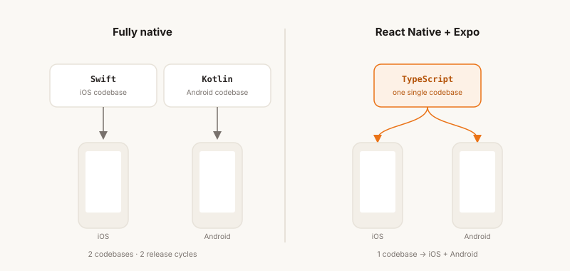
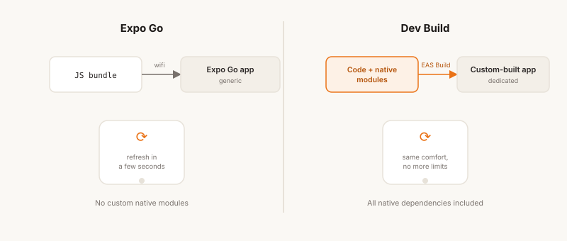
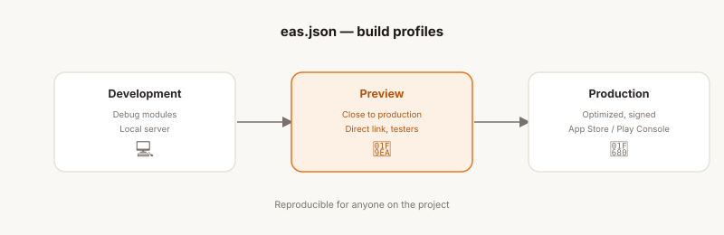
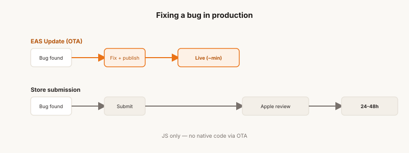

## Let's be honest

I'm a backend developer. I've spent most of my career designing APIs, thinking in terms of data models, SQL query optimization, and data serialization. Frontend always felt like another world to me — not inaccessible, but far enough from my habits that I never really took the leap. Mobile, even more so.

Then came the moment to build Fusily.

Fusily is an app built for cooking enthusiasts: share recipes, discover new ones, plan them out for the week, generate a shopping list, and get guided step by step at the stove. A complete product, with a real user experience to take care of, and a very concrete dimension — people literally use it with flour on their hands.

Building that meant building a mobile app. And building a mobile app as a backend developer meant making smart choices.

## Why not go fully native?

The first, unavoidable question: Swift/Kotlin or cross-platform?

The answer turned out to be simple: going fully native just wasn't realistic in my context. Learning Swift *and* Kotlin in parallel, maintaining two codebases, two release cycles, two testing environments — that's an investment of time and effort that only makes sense for teams dedicated to each platform.

What I wanted was to write code once, deploy it to both iOS and Android, without sacrificing the user experience. And if possible, build on skills I already had (a little): JavaScript/TypeScript, asynchronous programming, a certain architectural rigor.

**React Native** fit that equation. Meta's framework lets you write components in JavaScript/TypeScript that compile down to real native components — not a disguised WebView. Performance is good, the community is massive, and the ecosystem is mature.

But React Native on its own is also a setup that can quickly turn into a full-time job. That's where Expo comes in.

## Expo: the ecosystem that makes mobile accessible

Expo isn't just a build tool. It's a complete toolkit that covers the entire lifecycle of a mobile app, from the first `npx create-expo-app` all the way to publishing on the App Store and Google Play.

When I started Fusily, Expo's promise was simple: let you focus on your product, not on the plumbing. Coming from backend, where I'm used to spending time on infrastructure, that promise had something genuinely appealing about it.

Here's how it played out in practice.

## Day-to-day development: Expo Go and dev builds

For the first few weeks with Expo, you work with **Expo Go** — an app you install on your physical phone (or a simulator) that loads your app's JavaScript bundle over the local network. You edit a component, save, and the app updates on your device within seconds. It's the mobile equivalent of the Fast Refresh you know from web development, right in your pocket.

It's a nice experience. But Expo Go has its limits: it doesn't support custom native modules. As soon as you step outside the ecosystem of officially supported libraries — which happens pretty quickly on a real project — you need to move to **dev builds**.

A dev build is a version of the app compiled with the full set of native dependencies, running against a JavaScript development server. In practice, you generate a build for each platform (iOS and Android), either locally or via **EAS Build** (Expo's cloud build service), install it on your device, and get back most of the comfort of Expo Go — Fast Refresh — without its constraints.

For Fusily, the move to dev builds happened naturally, as soon as I started integrating features that touch the phone's hardware (photo uploads from the library, notifications, haptic feedback, etc.).

## The dependency ecosystem: Expo's real treasure

This might be what surprised — and convinced — me the most. Expo maintains and distributes a set of libraries for accessing native device capabilities — all versioned, tested, and compatible with each other.

Here are a few concrete examples of what I used on Fusily:

**`expo-haptics`** — Haptic feedback, those micro-vibrations that give an interaction some texture. In Fusily, when a user reorders a recipe's media, a light haptic tap confirms the temporary position, and a stronger one confirms the final position when the user releases the media. It sounds trivial, but this kind of detail is what makes the difference in how an app feels. Integrating it took literally 5 seconds.

**`expo-secure-store`** — Secure storage, built on top of iOS's Keychain and its Android equivalent. I use it to persist authentication tokens securely, instead of relying on AsyncStorage, which stores data in plain text. For a backend developer used to thinking in terms of data security, that's the expected behavior — and it's available through a three-line API.

**`expo-image-picker`** — Selecting photos from the gallery or the camera. On Fusily, users can attach one or more photos or videos to their recipes. Handling permissions, opening the native picker, retrieving the image's metadata — all of that comes ready to use.

**`expo-notifications`** — Push notifications. More on this later, but Expo handles device registration, token management, and notification delivery through a unified iOS/Android abstraction.

What's fundamentally important about these dependencies is that they're **battle-tested** in the truest sense: used by thousands of apps in production, maintained by the Expo team, and updated in a coordinated way with every new React Native release. When you're on your own on a project, delegating that maintenance to a solid foundation is a sound strategic call.

## The build pipeline: dev, preview, production

Expo offers a cloud build service called **EAS Build** (Expo Application Services). It handles compiling the app — a process that, in fully native development, requires Xcode for iOS and Android Studio for Android, each with its own signing configurations, certificates, and provisioning profiles.

EAS Build abstracts away most of that complexity. Configuration lives in an `eas.json` file that defines the different build profiles:

**Development** — The dev build described above. Compiled with debug modules, connected to the local development server.

**Preview** — A version of the app close to production, distributable to internal testers via a direct link (without going through the stores). On Fusily, I use this profile to validate that the app works correctly on each OS — and yes, you can run into surprises and bugs that show up on a full build of the app but never appeared on the dev version.

**Production** — The final, optimized, signed version, ready for the stores. EAS can manage iOS certificates and Android keystores automatically if you want, or you can manage your own keys. The resulting binary can be submitted directly to App Store Connect and Google Play Console.

What's comfortable about this model is that it's **reproducible**. Anyone on the project can kick off a build without having to configure their local environment from scratch. For someone coming from backend and used to CI/CD pipelines, this approach makes immediate sense.

## Publishing to the stores: EAS Submit

Once the binaries are compiled, there's still the submission step. Apple and Google each have their own process — a fairly tedious one, with metadata configuration, screenshots at specific dimensions, descriptions, and content ratings.

**EAS Submit** automates the technical side: uploading the binary to App Store Connect or Google Play, using your configured credentials. The actual submission — Apple's review, Google's publishing — remains manual through their respective interfaces, but the packaging work is taken care of.

I once had a version of the app rejected on Apple's App Store over a permissions issue (a dependency error that triggered a request for permanent access to the phone's files and photos). That kind of friction is unavoidable, but at least EAS Submit makes sure the technical side isn't the obstacle.

## OTA Updates: shipping without going back through the stores

This might be the feature that won me over the most, from a backend perspective.

**EAS Update** lets you publish JavaScript updates directly to users' devices, **without submitting to the stores**. The principle: the app loads its JavaScript bundle from Expo's servers on startup, and if a new version is available, it downloads it and applies it on the next launch.

The limits are real — you can't change native code this way, only JavaScript. But that covers a large share of common cases: bug fixes, UI tweaks, small feature improvements.

On Fusily, this genuinely changes your relationship with deployment. A bug spotted in production can be fixed and shipped within minutes, without waiting on Apple's review cycle (which can take 24 to 48 hours). For a developer used to continuous deployment, getting that responsiveness back on mobile is a real relief.

Configuration happens through **channels** (production, preview, etc.) and **branches**, following a logic similar to Git. You can route updates to subsets of users — useful for a gradual rollout.

## Push Notifications: expo-notifications

For a long time, I kept putting off adding notifications to the app. But once an app has a social dimension (comments, likes, favorites, follows, etc.), users expect to receive notifications.

And handling push notifications on mobile is notoriously complex. There are two different channels (APNs for iOS, FCM for Android), permissions to manage on the client side, tokens to register and maintain on the server side, and behaviors that differ slightly between platforms.

**`expo-notifications`** simplifies all of that behind a common API. The flow is straightforward:

1. You ask the user for permission at the right point in the journey
2. You retrieve an **Expo Push Token** (a unique identifier per device, managed by Expo's servers)
3. You register that token on your backend
4. When you want to send a notification, you call the **Expo Push API** with the token and the payload

On Fusily, I use notifications to remind users of their planned meals, or to let them know a new recipe in their area of interest has been shared. The trickiest part was managing permissions (the UX of the permission prompt is critical — asking too early kills your acceptance rate), not the technical implementation.

## Looking back, a few months in

I won't pretend Expo is perfect. There's real friction at times: SDK upgrades that require migrations, third-party libraries that don't yet support Expo Modules, subtle behaviors that differ between iOS and Android and that only the native documentation can really help you debug.

But stepping back and looking at the whole experience — starting from zero, shipping Fusily on the App Store and the Play Store, maintaining and evolving the app — Expo delivered on its core promise: letting me focus on the product.

As a backend developer, I was able to build on my existing habits (API design, mobile interface design, data architecture) while learning a new rendering paradigm. React Native has its own idioms, its own performance constraints tied to the JavaScript/native bridge, its own layout quirks — it's a real learning curve. But the Expo ecosystem considerably reduced the friction on everything that isn't the actual product code. And ultimately, it's that combination — backend, API design, and now mobile end to end — that made me a full-stack developer.

If you're a backend developer considering building a mobile app, my advice is simple: don't underestimate React Native's learning curve, but don't overestimate it either. And choose Expo. The time you won't spend configuring builds and maintaining native dependencies is time you'll get to spend on what actually matters: your product.

---

*Fusily is available on the App Store and Google Play. If you want to share recipes, plan your meals, or just get more organized in the kitchen — [come check it out.](https://fusily.com)*
