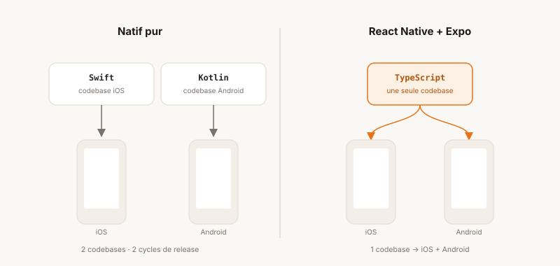
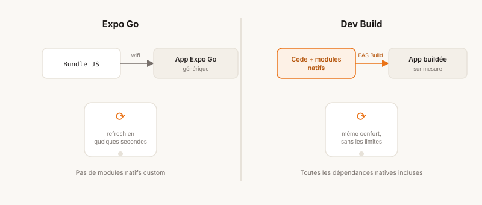
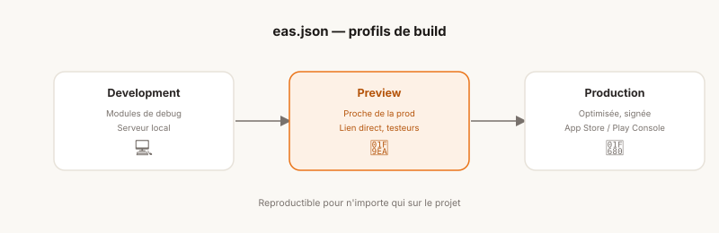
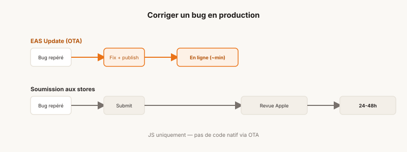

## Soyons honnêtes

Je suis développeur backend. J'ai passé la majorité de ma carrière de développeur à concevoir des APIs, à penser en termes de modèle de données, optimisation de requêtes SQL, de serialization de données. Le frontend m'a toujours semblé être un autre monde — pas inaccessible, mais suffisamment éloigné de mes habitudes pour que je n'aie jamais vraiment sauté le pas. Le mobile, encore plus.

Et puis est venu le moment de construire Fusily.

Fusily, c'est une application pensée pour les amateurs de cuisine : partager des recettes, en découvrir de nouvelles, les planifier dans la semaine, générer sa liste de courses et être guidé étape par étape devant les fourneaux. Un produit complet, avec une vraie expérience utilisateur à soigner, et une dimension très concrète — les gens l'utilisent les mains dans la farine, littéralement.

Construire ça impliquait une application mobile. Et construire une application mobile en tant que développeur backend impliquait de faire des choix intelligents.

## Pourquoi pas du natif pur ?

La première question, inévitable : Swift/Kotlin ou cross-platform ?

La réponse est assez simple finalement : du natif pur n'était tout simplement pas envisageable dans mon contexte. Apprendre Swift *et* Kotlin en parallèle, maintenir deux codebases, deux cycles de release, deux environnements de test — c'est un investissement humain et temporel qui n'a de sens que pour des équipes dédiées à chaque plateforme.

Ce que je voulais, c'était écrire du code une seule fois, le déployer sur iOS et Android, sans sacrifier l'expérience utilisateur. Et si possible, capitaliser sur des compétences que j'avais déjà (un peu) : JavaScript/TypeScript, la programmation asynchrone, une certaine rigueur architecturale.

**React Native** répondait à cette équation. Le framework de Meta permet d'écrire des composants en JavaScript/TypeScript qui se compilent en composants natifs réels — pas du WebView déguisé. Les performances sont bonnes, la communauté est massive, et l'écosystème est mûr.

Mais React Native seul, c'est aussi une configuration qui peut vite devenir un travail à plein temps. C'est là qu'Expo entre en jeu.

## Expo : l'écosystème qui rend le mobile accessible

Expo n'est pas juste un outil de build. C'est une suite d'outils complète qui englobe le cycle de vie entier d'une application mobile, du premier `npx create-expo-app` jusqu'à la publication sur l'App Store et Google Play.

Quand j'ai démarré Fusily, la promesse d'Expo était simple : te laisser te concentrer sur ton produit, pas sur la plomberie. En venant du backend, où j'ai l'habitude de passer du temps sur de l'infrastructure, cette proposition avait quelque chose de réjouissant.

Voilà comment ça s'est articulé en pratique.

## Le développement au quotidien : Expo Go et les dev builds

Les premières semaines avec Expo, on travaille avec **Expo Go** — une application que l'on installe sur son téléphone physique (ou un simulateur), qui charge le bundle JavaScript de l'app via le réseau local. On modifie un composant, on sauvegarde, l'app se met à jour en quelques secondes sur le device. C'est l'équivalent du hot reload qu'on connaît en web, mais dans sa poche.

C'est plaisant. Mais Expo Go a ses limites : il ne supporte pas les modules natifs custom. Dès qu'on sort de l'écosystème des bibliothèques officiellement supportées — ce qui arrive assez vite sur un vrai projet — il faut passer aux **dev builds**.

Un dev build, c'est une version de l'app compilée avec l'ensemble des dépendances natives, qui tourne grâce à un serveur de développement JavaScript. En pratique, on génère un build pour chaque plateforme (iOS et Android), soit en local, soit via **EAS Build** (le service de build cloud d'Expo), on l'installe sur son device, et on retrouve l'essentiel du confort d'Expo Go — le rechargement rapide — sans ses contraintes.

Pour Fusily, le passage aux dev builds s'est imposé assez naturellement, dès que j'ai commencé à intégrer des fonctionnalités qui touchent au hardware du téléphone (upload de photos depuis la bibliothèque, notifications, retours haptiques, etc.).

## L'écosystème de dépendances : le vrai trésor d'Expo

C'est peut-être ce qui m'a le plus surpris, et le plus convaincu. Expo maintient et distribue un ensemble de bibliothèques pour accéder aux capacités natives des devices — toutes versionnées, testées, et compatibles entre elles.

Voici quelques exemples concrets de ce que j'ai utilisé sur Fusily :

**`expo-haptics`** — Le feedback haptique, ces micro-vibrations qui donnent du relief à une interaction. Dans Fusily, quand l'utilisateur réorganise les médias de sa recette, un léger retour haptique valide le positionnement temporaire, un retour plus puissant valide la position quand l'utilisateur relâche le média. Ça paraît anodin, mais c'est ce genre de détail qui fait la différence dans le ressenti d'une app. L'intégration m'a pris littéralement 5 secondes.

**`expo-secure-store`** — Le stockage sécurisé, en s'appuyant sur le Keychain d'iOS et l'équivalent Android. J'utilise cette dépendance pour persister les tokens d'authentification de manière sécurisée, sans passer par AsyncStorage qui écrit en clair. Pour un développeur backend habitué à penser en termes de sécurité des données, c'est le comportement attendu — et il est disponible avec une API en trois lignes.

**`expo-image-picker`** — La sélection de photos depuis la galerie ou l'appareil photo. Sur Fusily, les utilisateurs peuvent associer une ou plusieurs photos ou vidéos à leurs recettes. Gérer les permissions, ouvrir le sélecteur natif, récupérer les métadonnées de l'image — tout ça est prêt à l'emploi.

**`expo-notifications`** — Les push notifications. J'y reviendrai, mais Expo gère l'enregistrement du device, la gestion des tokens et la réception des notifications via une abstraction unifiée iOS/Android.

Ce qui est fondamentalement important dans ces dépendances, c'est qu'elles sont **battle-tested** au sens réel du terme : utilisées par des milliers d'applications en production, maintenues par les équipes Expo, mises à jour de manière coordonnée à chaque nouvelle version de React Native. Quand on est seul sur un projet, déléguer cette maintenance à une fondation solide, c'est une décision stratégique saine.

## Le pipeline de builds : dev, preview, production

Expo propose un service de build cloud appelé **EAS Build** (Expo Application Services). Il gère la compilation de l'application — un processus qui, en natif pur, nécessite Xcode pour iOS et Android Studio pour Android, avec leurs propres configurations de signing, de certificates, de provisioning profiles.

EAS Build abstrait une grande partie de cette complexité. La configuration se fait dans un fichier `eas.json` qui définit les différents profils de build :

**Development** — Le dev build décrit plus haut. Compilé avec les modules de debug, connecté au serveur de développement local.

**Preview** — Une version de l'app proche de la production, distribuable à des testeurs internes via un lien direct (sans passer par les stores). Sur Fusily, j'utilise ce profil pour valider le fonctionnement de l'application sous chaque OS — et oui, on peut avoir des surprises, des bugs qui apparaissent sur un build complet de l'application mais qui n'apparaissaient pas sur la version dev.

**Production** — La version finale, optimisée, signée, prête pour les stores. EAS gère les certificates iOS et les keystores Android automatiquement si on le souhaite, ou on peut gérer ses propres clés. Le binaire produit peut être directement soumis à App Store Connect et à Google Play Console.

Ce qui est confortable dans ce modèle, c'est qu'il est **reproductible**. N'importe qui sur le projet peut lancer un build sans avoir à configurer son environnement local de A à Z. Pour quelqu'un qui vient du backend et est habitué à des pipelines CI/CD, c'est une approche qui fait sens immédiatement.

## La publication sur les stores : EAS Submit

Une fois les binaires compilés, reste l'étape de soumission. Apple et Google ont chacun leur processus — relativement fastidieux, avec des configurations de metadata, des captures d'écran à des dimensions spécifiques, des descriptions, des classifications de contenu.

**EAS Submit** automatise la partie technique : l'upload du binaire vers App Store Connect ou Google Play, en utilisant les credentials configurés. La soumission proprement dite — review d'Apple, publication Google — reste manuelle via leurs interfaces respectives, mais le travail de packaging est pris en charge.

Il m'est arrivé que la soumission d'une version de l'application sur l'App Store d'Apple soit rejetée pour une raison de permissions (une erreur de dépendances qui entraîne la demande de l'accès permanent aux fichiers et photos du téléphone). C'est le genre de friction qu'on ne peut pas éviter, mais EAS Submit fait au moins en sorte que la partie technique ne soit pas un obstacle.

## OTA Updates : déployer sans repasser par les stores

C'est peut-être la fonctionnalité qui m'a le plus séduit d'un point de vue backend.

**EAS Update** permet de publier des mises à jour JavaScript directement sur les devices des utilisateurs, **sans soumission aux stores**. Le principe : l'application charge son bundle JavaScript depuis les serveurs d'Expo au démarrage, et si une nouvelle version est disponible, elle la télécharge et l'applique au prochain lancement.

Les limites sont réelles — on ne peut pas modifier du code natif par cette voie, seulement le JavaScript. Mais ça couvre une large part des cas courants : corrections de bugs, ajustements d'interface, petites évolutions de features.

Sur Fusily, ça change concrètement le rapport au déploiement. Un bug repéré en production peut être corrigé et déployé en quelques minutes, sans attendre le cycle de review Apple (qui peut prendre 24 à 48 heures). Pour un développeur habitué à déployer en continu, retrouver cette réactivité côté mobile est un vrai soulagement.

La configuration se fait via des **channels** (production, preview, etc.) et des **branches**, avec une logique similaire à Git. On peut router les mises à jour vers des sous-ensembles d'utilisateurs — utile pour un déploiement progressif.

## Push Notifications : expo-notifications

Pendant longtemps, j'ai repoussé l'ajout de notifications dans l'application. Or, lorsque l'on parle d'une application avec une dimension sociale (commentaires, likes, favoris, follows, etc.), les utilisateurs s'attendent à recevoir des notifications.

Or, la gestion des push notifications sur mobile est notoirement complexe. Il y a deux canaux différents (APNs pour iOS, FCM pour Android), des permissions à gérer côté client, des tokens à enregistrer et maintenir côté serveur, et des comportements légèrement différents entre plateformes.

**`expo-notifications`** simplifie tout cela derrière une API commune. Le flow est classique :

1. On demande la permission à l'utilisateur au bon moment dans le parcours
2. On récupère un **Expo Push Token** (un identifiant unique par device, géré par les serveurs Expo)
3. On enregistre ce token sur son backend
4. Quand on veut envoyer une notification, on appelle l'**Expo Push API** avec le token et le payload

Sur Fusily, j'utilise les notifications pour rappeler aux utilisateurs les repas planifiés, ou les informer qu'une nouvelle recette dans leur domaine d'intérêt a été partagée. La partie la plus délicate a été la gestion des permissions (l'UX de la demande de permission est critique — la demander trop tôt tue le taux d'acceptation), pas la partie technique.

## Le bilan après quelques mois

Je ne vais pas prétendre qu'Expo est parfait. Il y a des moments de friction : des mises à jour de SDK qui demandent des migrations, des bibliothèques tierces qui ne supportent pas encore Expo Modules, des comportements subtils qui diffèrent entre iOS et Android et que seule la documentation native permet de déboguer vraiment.

Mais si je prends du recul sur l'expérience globale — démarrer de zéro, livrer Fusily sur l'App Store et le Play Store, maintenir et faire évoluer l'app — Expo a tenu sa promesse fondamentale : me laisser me concentrer sur le produit.

En tant que développeur backend, j'ai pu capitaliser sur mes habitudes (design d'API, design d'interface mobile, architecture des données) tout en apprenant un nouveau paradigme de rendu. React Native a ses propres idiomes, ses contraintes de performance liées au bridge JavaScript/natif, ses subtilités de layout — c'est un vrai apprentissage. Mais l'écosystème Expo a considérablement réduit la surface de friction sur tout ce qui n'est pas le code produit lui-même. Et au bout du compte, c'est bien cette combinaison — backend, API, et maintenant mobile de bout en bout — qui a fait de moi un développeur full-stack.

Si tu es développeur backend et que tu envisages de construire une application mobile, mon conseil est simple : ne sous-estime pas la courbe d'apprentissage de React Native, mais ne la surestime pas non plus. Et choisis Expo. Le temps que tu ne passeras pas à configurer des builds et à maintenir des dépendances natives est du temps que tu pourras consacrer à ce qui compte : ton produit.

---

*Fusily est disponible sur l'App Store et le Google Play Store. Si tu veux partager des recettes, planifier tes repas ou simplement mieux t'organiser en cuisine — [viens voir](https://fusily.com).*
